# MultiFloorHospital

An object oriented programming university project that simulates the behavior of a multi floor hospital monitoring application.

## Table of Contents
1. [Introduction](#introduction)
2. [Overview](#overview)
3. [Set-up](#set-up)
4. [Usage](#usage)
5. [UML Diagram](#diagram)


## Introduction

The main purpose of the project is to simulate the behavior of a multi floor hospital monitoring system. It allows to keep track of and manipulate different hospital entities like :

* patients
* hospital staff
* equipment
* pharmasy
* financial account
* hospital rooms

They are connected to eachother, for example deleting a patient makes staff assigned to them free etc. Furthermore there are options to save data locally and to load previously saved data.

The interaction with the system is 1 to 1, meaning it is intended to be used only locally on the terminal it was ran on, and does not provide any web api.

## Overview
The application allows the user to add/delete and observe patients, hospital staff members, 
equipment pieces, and pharmasy items. To perform all the actions there is a simple and 
intuitive GUI.

Additionally, the application allows to serialize the data and store it in a file.
The data could be load to the program later.

## Set-up
There already is a compiled version of the program as well as `MultiFloorHospital.jar`, which runs the appication, in `build` foulder. However, to make sure that the executable is really the compiled code from `scr` foulder, the code could be easily compiled once again (if you have **Windows** operating system and **GNU make** installed) by running:
```
make compile
```
It runs the `compile.bat` script, which compiles the code once again and produces a new .jar file.

Then, to run the application, there is another make rule:
```
make run
```
This will just execute the `MultiFloorHospital.jar`, running the application.

Thus, running `make compile` and then `make run` will definetely run the appication.

In case you do not have linux or mac, just run the application by running this command:
```
java -jar ./build/MultiFloorHospital.jar
```

Or execute the `MultiFloorHospital.jar` manually.

## Usage

Having launched the program, you will see an option to load the data.

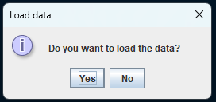

In case you do not have a previously saved data (by default there is a file with some test data), or you just want to start from scratch, you should choose **No** option, and it will move you to **login page** immediatly.

In case you want to load the data, choose **Yes**. Then you will have to specify the filename.

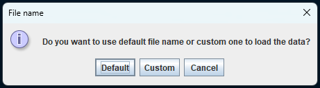

Choose **Default** for the default file name, and **Custom**, if prevously you have saved the data with custom file name. **Cancel** option is there if you changed your mind and no longer want to load the data.

Having choosen default filename, the data will be loaded automatically, while custom file name will ask you to specify the name.

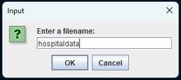

After loading the data, you will see the **login page**.

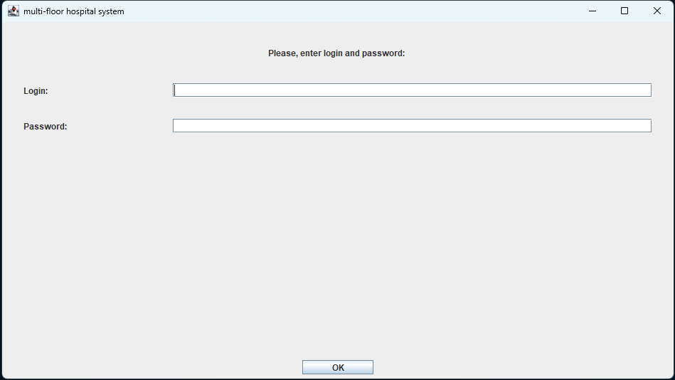

Login and password should be set as the environmental variables with these names:
```
HOSPITAL_LOGIN=login
HOSPITAL_PASSWORD=password
```

If they are not set, login is `login` password is `password`.
<BR>
So if you just want to enter the system, type `login` for login and `password` for password. Or if you specified custom login and password in the environment, type the cusom ones.

If you run the application through `make` rules, it exports environmental variables from the `./.env/.env`, so you can specify the custom login and password there.

After this, you will see the main page:

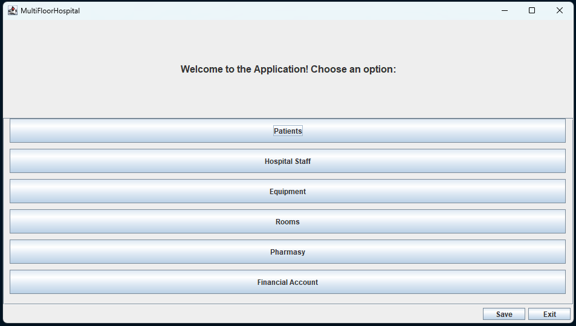

The first option is `Patients`. There you can observe, add, and delete patients.

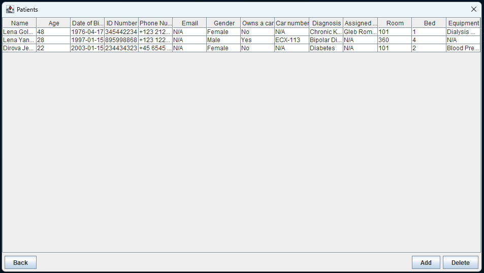

**Add** button leads to add form.

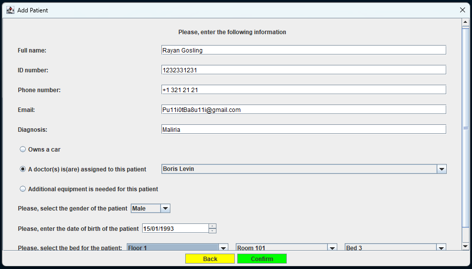

Then in main menu there is `Hospital Staff` option.

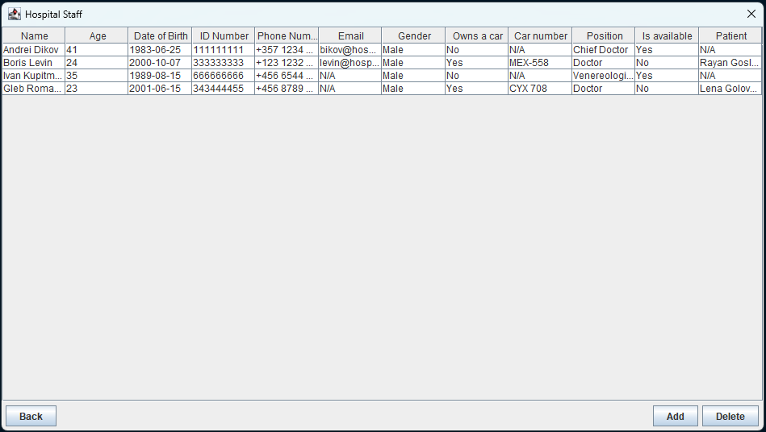

**Add** button leads to add form.

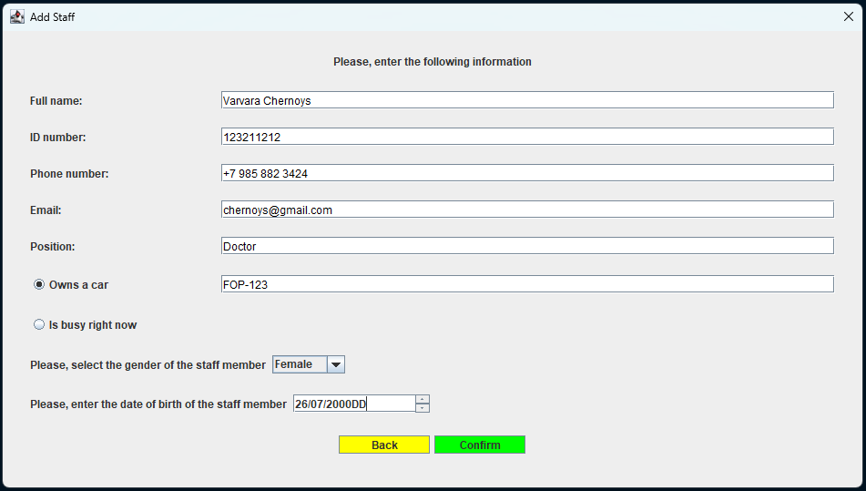

The next option is `Equipment`.

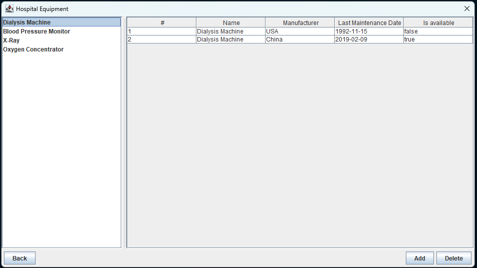

**Add** button leads to add form.

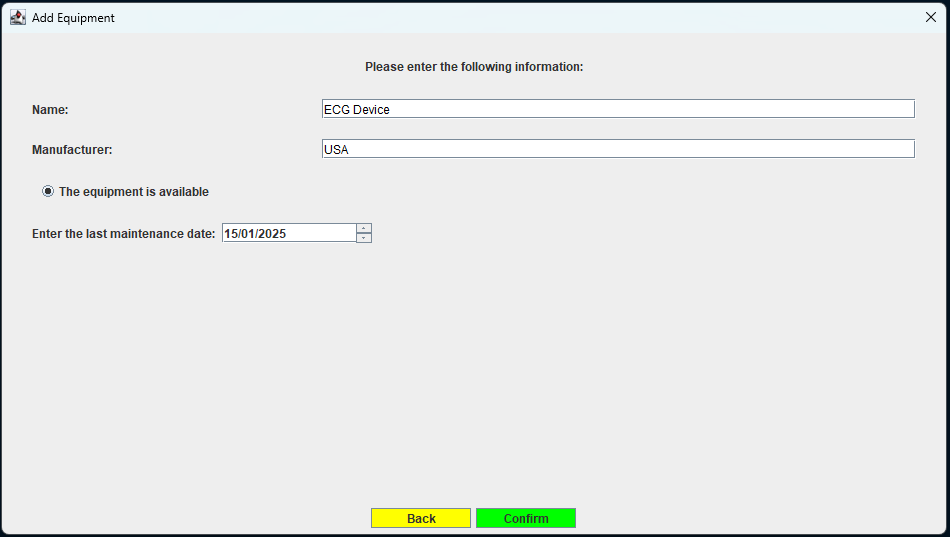

Further there is `Rooms` option. It allows to observe all rooms and patients in this rooms. The number of rooms is fixed and could be configured only inside the code in `HospitalProperties` interface. The default numbers:
```
NUMBER_OF_BEDS_PER_ROOM = 5;
NUMBER_OF_ROOMS_PER_FLOOR = 99;
NUMBER_OF_FLOORS = 3;
```

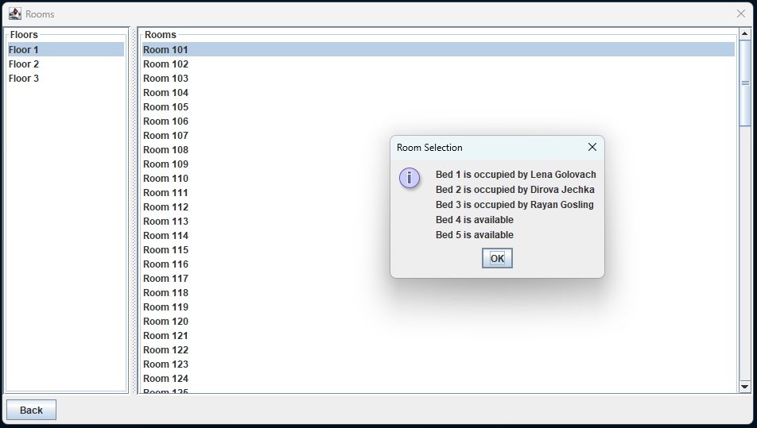

Next, there is `Pharmasy` option.

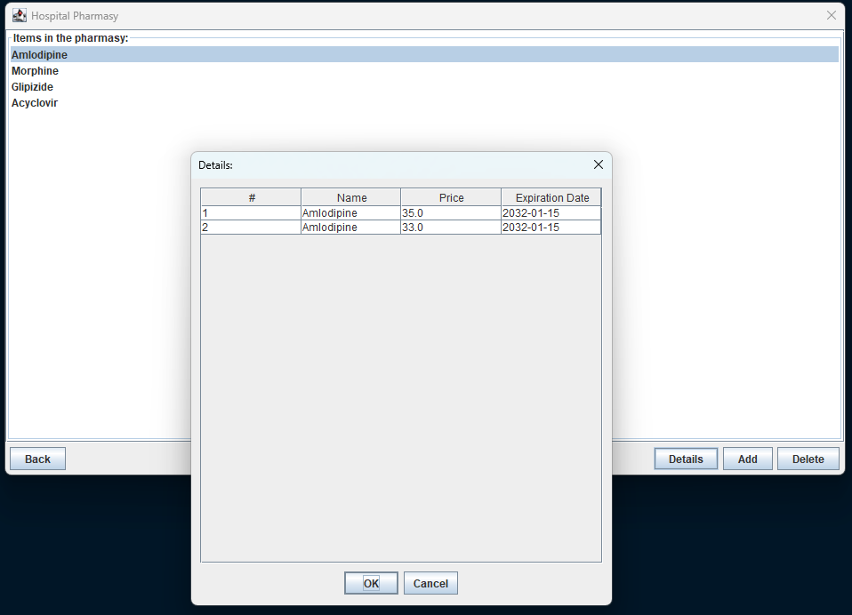

**Add** button leads to add form.

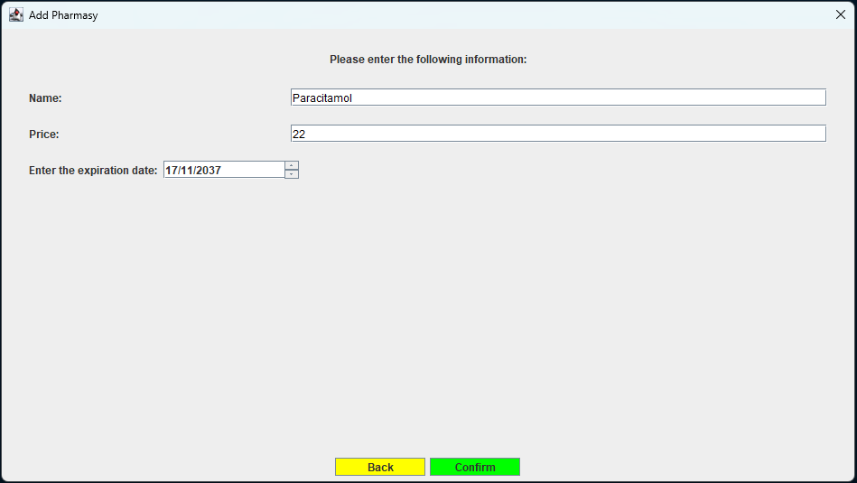

And last but not least there is `Financial Account` option.

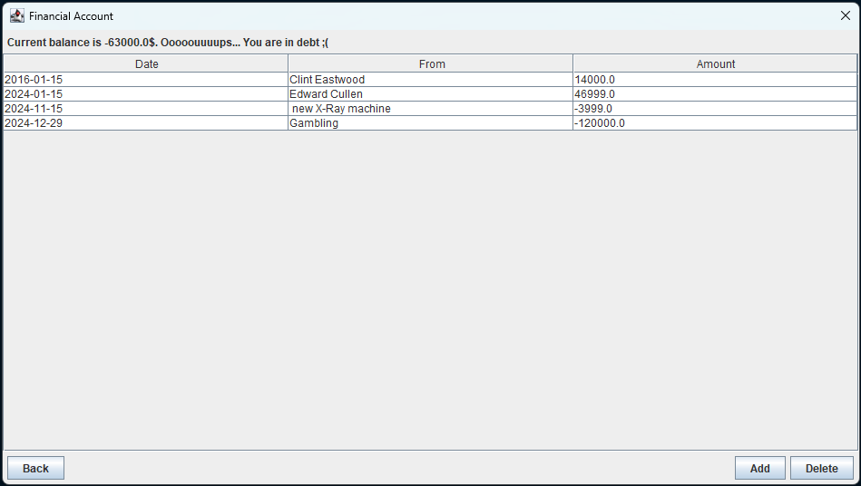

**Add** button leads to add form.

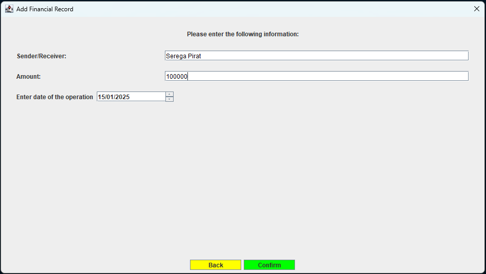

The last two options are `Exit` and `Save`. The former option just closes the application and does not save any data, while the latter one saves the data either to default file name, or to custom, similar to the load data selection. 

## Diagram

The diagram demonstrates classes and their relations. For simplisity unnesessary fields (e.g. getters, setters, and some constructors if they are not important) are ommited in order not to overload the diagram. The aim was to focus on denoting the main logic. Additionally, GUI elements are not displayed on the diagram, as they are not a part of application logic and do not help understand how the application works. 

The diagram on the image could look confusing, so there is additionally `.drawio` file in the `doc` foulder. This should help to inspect it in better quality.

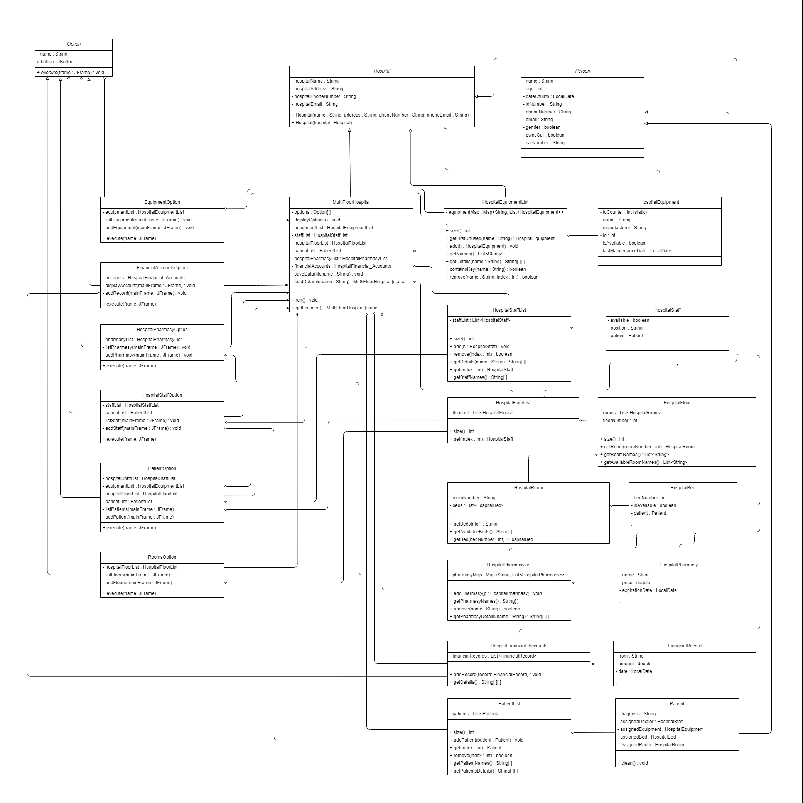